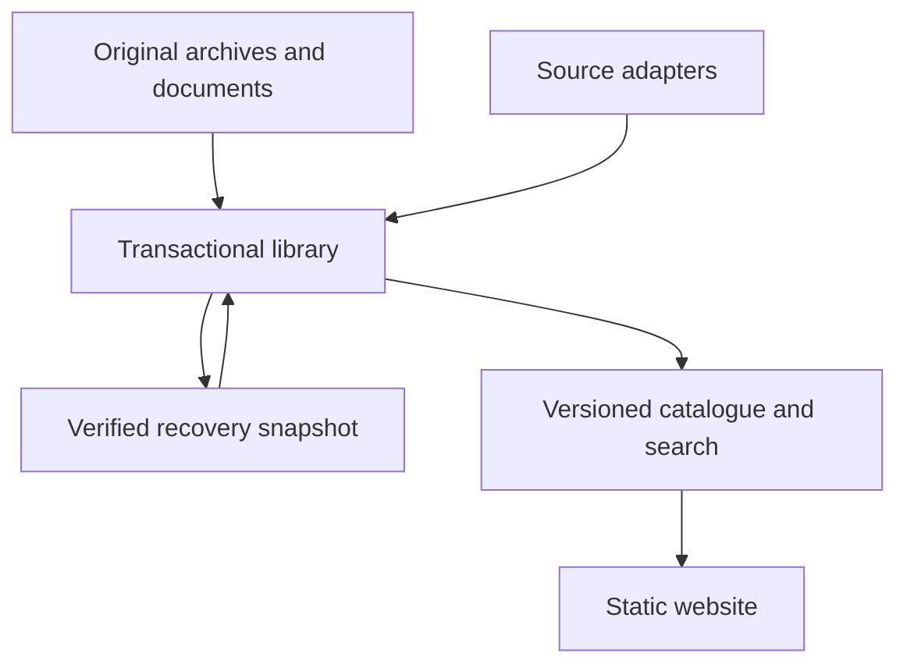

# Sanhedrin architecture

The database is the durable publication state. Repository archives are repeatable import inputs. The browser reads a bounded, versioned static export.

## Identity and preservation

`public_id` is the permanent link identity. `(provider, native_id)` identifies an item at its original source. The original URL determines the provider when legacy source labels are wrong. Mi Yodeya and Yeshiva number 137101 are separate records. Five historical duplicate Mi Yodeya identities retain their separate public IDs; source updates apply to all existing public records for that identity.

Historical aliases can map to several records. A supplied `src` path resolves the historical context first. Without context, a current public ID takes precedence; ambiguous native numbers prompt a choice. URLs are never assembled from untrusted provider labels. WordPress IDs are adopted only when verified through the publisher API; old synthetic IDs and aliases remain valid after slug changes.

SQLite uses WAL, foreign keys, FULL synchronization and page transactions. Originals, import hashes, source revisions, quarantine reasons, aliases, cursors and source-check state are stored separately. Data and cursor commit together. A file is reimported only after its SHA-256 changes. Repeated imports are idempotent. A process lock rejects concurrent publishers using the same state directory.

New `ERROR 404` placeholders are quarantined. Already published incomplete records stay accessible and visibly incomplete. Missing full texts with valid title/source URL become link records. Metadata updates cannot erase existing question/answer bodies or manual categories. Full source changes retain earlier published bodies in revisions. Remote 404/410 or a failed request never deletes public entries.

The first Yeshiva import of 2026 remains represented by all 246 source-specific records and its exact normalized export timestamp. Each import charge records path and date. `published_at`, `saved_at`, `imported_at` and `source_checked_at` are distinct. Legacy ambiguous dates are not relabeled as verified publication dates.

## Complete search with small reads

The exporter sanitizes and renders each question and every retained answer, then indexes the full texts. Title/tag/question/answer matches have weights 8/6/3/1. Multiple query tokens use intersection, and filters apply to all matches before pagination. A narrow controlled synonym map handles English transliterations. NFKC normalization removes Hebrew cantillation/niqqud. There is no morphological stemming; related inflected words can require separate queries.

The browser fetches the small manifest, needed facet/token shards and only the metadata pages required for 48 visible cards. Detail pages fetch one content record. Locator and alias shards replace the large runtime `responsa.json`. Search shards have 4,096 possible hash prefixes; locators have 256. The manifest points to a content-derived release directory so a browser cannot silently combine two versions. A missing old shard after publication asks the user to refresh.

The build first generates a separate directory, checks counts/checksums and a 900 MB final uncompressed byte budget, then replaces the selected output directory. Failed builds preserve the previous site. Old local build directories remain available until operational retention is managed; no automatic deletion is introduced.

## HTML and document handling

HTML5 sanitization removes active elements, event handlers and unsafe URL protocols. Markdown is rendered and sanitized through the same path. Source attribution is displayed separately, including verified Stack Exchange licensing and author links. Unknown legacy licensing remains labeled as unrecorded.

The 17 responsa documents are discovered from original files and the legacy index. Their published paths remain available. Inline PNG/JPEG/GIF/WebP images are signature-checked and extracted to hashed assets; tooltip text remains readable. The generated pages use restrictive CSP and contain no active source scripts. Search indexes document text without moving it into the old monolith.

## Collection and observability

The transport allows configured HTTPS hosts only, checks redirects, strips authentication across hosts, limits compressed/decompressed responses, honors budgets/backoff/Retry-After and checks robots policy. Long delays defer work. Credentials are read only at runtime and are excluded from public reports.

Stack Exchange commits a question page only after fetching all its native answers and verifying each remote count. WordPress uses a frozen modification window with overlap, validates pagination headers and timestamps, and rejects repeated pages. Offset pagination still cannot guarantee an unchanging source while it is edited; the overlap recovers ordinary changes, while a publisher cursor feed is the stronger option.

RSS imports metadata and original links, preserving stored full texts. The publisher JSON feed supports durable opaque cursors and resumable next-page URLs. Yeshiva JSON-LD/body selectors are available for permitted full collection, but the live site's access protection is not bypassed. Source runs record success, failure or deferral. A public status page reports those results; deployment health remains visible in Actions.
